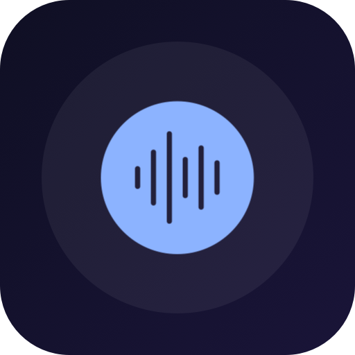
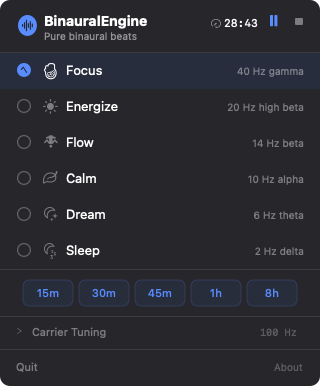

<p align="center">
  
</p>

# BinauralEngine

A native macOS menu bar app that generates pure binaural beats for focus, relaxation, and sleep. No music, no noise — just clean sine waves backed by brainwave entrainment research.

  

<p align="center">
  
</p>

## What It Does

BinauralEngine sits in your menu bar and produces stereo binaural beats — a slightly different frequency in each ear that your brain perceives as a rhythmic pulse. Different pulse frequencies target different mental states:

| Preset | Beat Frequency | Brainwave Band | State |
|--------|---------------|----------------|-------|
| Focus | 40 Hz | Gamma | Deep concentration |
| Energize | 20 Hz | High Beta | Alertness & energy |
| Flow | 14 Hz | Beta | Active thinking |
| Calm | 10 Hz | Alpha | Relaxed alertness |
| Dream | 6 Hz | Theta | Creativity & meditation |
| Sleep | 2 Hz | Delta | Deep sleep |

## Features

- **Pure tones only** — mathematically generated sine waves, no samples or music
- **Menu bar native** — no dock icon, lives in your status bar
- **System integration** — works with macOS Now Playing, media keys, and AirPods controls
- **Session timers** — 15m, 30m, 45m, 1h, or 8h sessions
- **Carrier tuning** — adjustable carrier frequency (40–500 Hz) to find your sweet spot
- **Preset switching** — next/prev track controls cycle through presets
- **Now Playing artwork** — per-preset colored thumbnails in Control Center

## Requirements

- macOS 13 (Ventura) or later
- Headphones (binaural beats require separate audio channels per ear)

## Build & Run

```bash
git clone https://github.com/emil-edilersky/BinauralEngine.git
cd BinauralEngine
./run.sh
```

`run.sh` builds via Swift Package Manager and wraps the binary in a `.app` bundle (required for MenuBarExtra). The app appears in your menu bar — click the waveform icon to open.

To build manually:

```bash
swift build
```

> **Note:** Running the bare binary (`swift run` or `.build/.../BinauralEngine`) won't work because SwiftUI's `MenuBarExtra` requires a proper `.app` bundle to register with the window server.

## How It Works

Two sine waves at slightly different frequencies are played — one in each ear. Your auditory brainstem creates an interference pattern perceived as a pulsing "beat" at the difference frequency. This may entrain brainwaves toward that frequency (the **frequency following response**).

The carrier frequency (default 100 Hz) determines the base tone you hear. The beat frequency is the difference between left and right channels. Research suggests carriers in the 100–500 Hz range work best for perceiving binaural beats (Oster, 1973; Licklider, 1950).

For a deeper dive, see [docs/why-it-works.md](docs/why-it-works.md).

## Architecture

```
Sources/
├── BinauralEngineApp.swift    # @main, MenuBarExtra, AppDelegate
├── Models/
│   ├── AppState.swift         # Central state coordinator
│   ├── Preset.swift           # Preset definitions & session durations
│   └── SessionTimer.swift     # Countdown timer
├── Services/
│   ├── ToneGenerator.swift    # AVAudioEngine + real-time sine generation
│   └── NowPlayingService.swift # MPNowPlayingInfoCenter integration
├── Views/
│   └── MenuBarView.swift      # SwiftUI popover UI
└── Resources/
    └── Info.plist
```

Key technical choices:
- **AVAudioSourceNode** render callback for sample-accurate sine wave generation
- **UnsafeMutablePointer** for lock-free communication with the real-time audio thread
- **Per-sample gain smoothing** for click-free fade in/out
- **Combine pipelines** for reactive carrier/preset switching

## License

MIT License. See [LICENSE](LICENSE).
